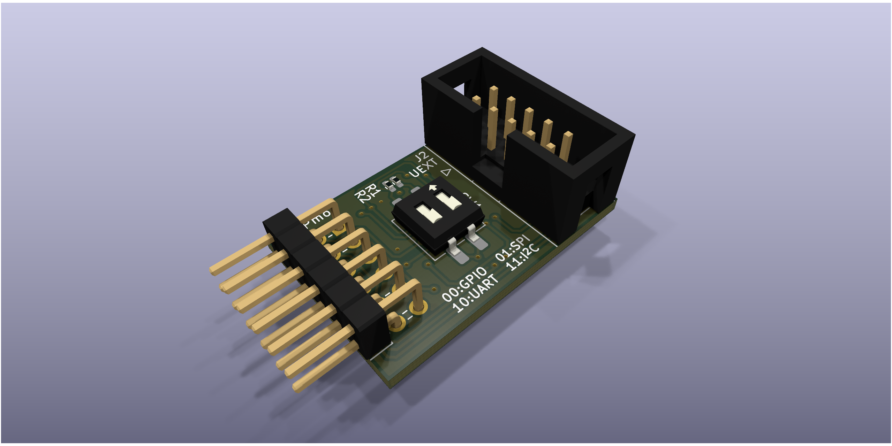
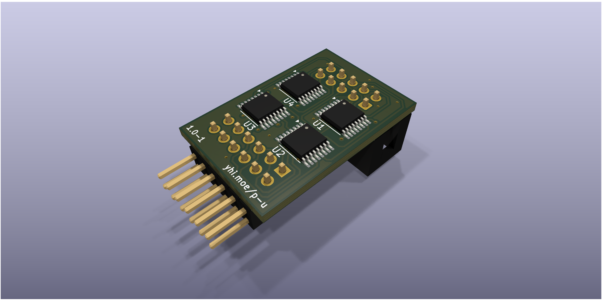

<!--
    SPDX-FileCopyrightText: 2025 Junde Yhi <junde@yhi.moe>
    SPDX-License-Identifier: CC-BY-SA-4.0
-->

# Pmod&trade; Compatible UEXT Adapter Board

This Digilent Pmod&trade; Compatible module converts between a 12-pin Pmod interface to an Olimex Universal Extension Connector (UEXT) interface.

## Errata 1.x

This section lists known issues of the product in version 1.x.

- It's difficult to solder VCC and GND pins.
    - Reason: too much thermal relief.
    - Mitigation: use flux and retain soldering tip on the plate for an extended time.
- SW1 switch positions doesn't match the description printed beside it.
    - Reason: on the PCB design file, SW1 is mistakenly placed upside-down.
    - Mitigation: flip SW1 by 180 degree, replacing it upright (i.e. first pin at the bottom-left corner). This doesn't change the function of the DIP switch.
- I2C pins (under Pmod Type 6/A) cross-talk with each other slightly (approximately 100mV).
    - Reason: suboptimal PCB trace placement.
    - Mitigation: none. In theory, the cross-talk signal won't be strong enough to disrupt the signals on another pin.

## Use

Select a Pmod interface type with the DIP switch (SW1). This routes the correct pins between Pmod and UEXT.

| Left | Right | Pmod Interface  |
| ---- | ----- | --------------- |
| Off  | Off   | Type 1A (GPIO)  |
| Off  | On    | Type 2A (SPI)   |
| On   | Off   | Type 3A (UART)  |
| On   | On    | Type 6A (I2C)   |

Power and ground on both sides are always connected. Other I/O pins are left open. Note that the module is not completely passive: the onboard multiplexers take power. If a voltage supply is higher than 5V, they can be destroyed. Most (if not all) Pmod and UEXT modules run on 3.3V. This module should only be used in compliant Pmod and UEXT systems.

### Type 1A (GPIO) Mappings

| Pmod Pin     | UEXT Pin  |
| ------------ | --------- |
|  1 (GPIO  1) |  3 (TXD)  |
|  2 (GPIO  2) |  4 (RXD)  |
|  3 (GPIO  3) |  5 (SCL)  |
|  4 (GPIO  4) |  6 (SDA)  |
|  7 (GPIO  7) |  7 (MISO) |
|  8 (GPIO  8) |  8 (MOSI) |
|  9 (GPIO  9) |  9 (SCK)  |
| 10 (GPIO 10) | 10 (SSEL) |

### Type 2A (SPI) Mappings

| Pmod Pin | UEXT Pin  |
| -------- | --------- |
| 1 (CS)   | 10 (SSEL) |
| 2 (MOSI) |  8 (MOSI) |
| 3 (MISO) |  7 (MISO) |
| 4 (SCK)  |  9 (SCK)  |

### Type 3A (UART) Mappings

| Pmod Pin | UEXT Pin  |
| -------- | --------- |
| 2 (TXD)  | 3 (TXD)   |
| 3 (RXD)  | 4 (RXD)   |

### Type 6A (I2C) Mappings

| Pmod Pin | UEXT Pin  |
| -------- | --------- |
| 3 (SCL)  | 3 (SCL)   |
| 4 (SDA)  | 4 (SDA)   |

## License

The hardware design is licensed under the [CERN Open Hardware Licence Version 2 (Strongly Reciprocal)][ohl-s-2.0]. A copy of license text can be found at [LICENSES/CERN-OHL-S-2.0.txt](./LICENSES/CERN-OHL-S-2.0.txt).

Non-hardware contents in this project are licensed under the [Creative Commons Attribution-ShareAlike 4.0 International][cc-by-sa-4.0] license. A copy of license text can be found at [LICENSES/CC-BY-SA-4.0.txt](./LICENSES/CC-BY-SA-4.0.txt).

Check [REUSE.toml](./REUSE.toml) for information about licenses applicable to individual files. Alternatively, check the comment header of a file for the license applicable to it. For details, visit <https://reuse.software>.

[ohl-s-2.0]: https://ohwr.org/cern_ohl_s_v2.pdf
[cc-by-sa-4.0]: https://creativecommons.org/licenses/by-sa/4.0/
