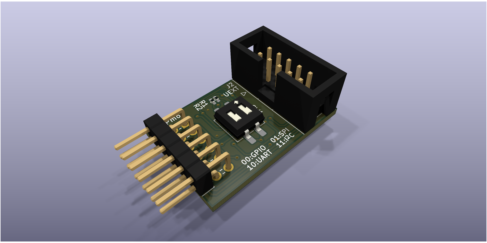
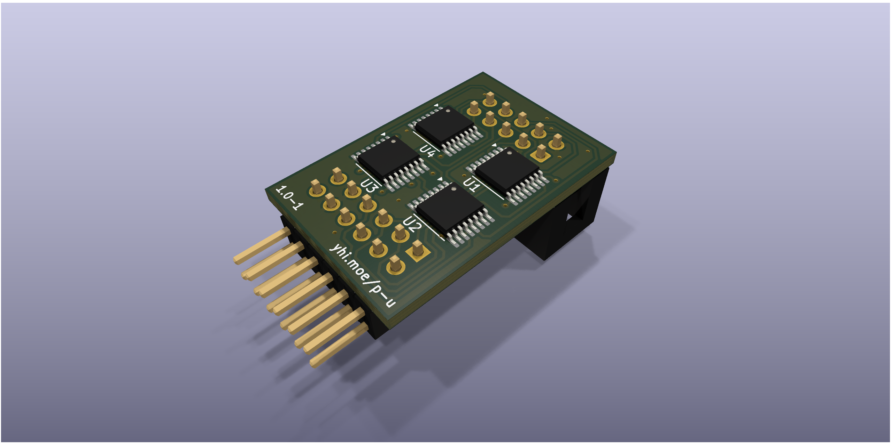

<!--
    SPDX-FileCopyrightText: 2025 Junde Yhi <junde@yhi.moe>
    SPDX-License-Identifier: CC-BY-SA-4.0
-->

# Pmod&trade; Compatible UEXT Adapter Board

This [Digilent Pmod&trade;][pmod] Compatible module converts between a 12-pin Pmod interface to an [Olimex Universal Extension Connector (UEXT)][uext] interface.

[pmod]: https://digilent.com/reference/pmod/start
[uext]: https://www.olimex.com/Products/Modules/UEXT/

## Use

Select a Pmod interface type with the DIP switch (SW1). This routes the correct pins between Pmod and UEXT.

| Left   | Right   | Pmod Interface           |
| ------ | ------- | ------------------------ |
| 0/Off  | 0/Off   | Type 1A (Expanded GPIO)  |
| 0/Off  | 1/On    | Type 2 (SPI)             |
| 1/On   | 0/Off   | Type 3 (UART)            |
| 1/On   | 1/On    | Type 6 (I2C)             |

Check pin-to-pin mappings in the subsections below.

Power and ground on both sides are always connected. Unconnected I/O pins are left floating.

Multiplexers are used to rewire pins on both ends, so the module is not passive; power is required for the conversion to work. The multiplexers can run at voltages between 1.8V and 5V. Most (if not all) Pmod and UEXT modules run on 3.3V, so it's safe to use the module on Pmod compliant and UEXT compliant systems.

### Type 1A (Expanded GPIO) Mappings

| Pmod Pin | UEXT Pin  |
| -------- | --------- |
| 1 (IO1)  | 3 (TXD)   |
| 2 (IO2)  | 4 (RXD)   |
| 3 (IO3)  | 5 (SCL)   |
| 4 (IO4)  | 6 (SDA)   |
| 7 (IO5)  | 7 (MISO)  |
| 8 (IO6)  | 8 (MOSI)  |
| 9 (IO7)  | 9 (SCK)   |
| 10 (IO8) | 10 (SSEL) |

This essentially maps all available pins from one side to the another. It assumes that UEXT pins are only used as GPIOs, which is allowed:

> _If you don't use the special function of some pins then they are used as GPIO's._

(Page 3, UEXT Specification, Revision B, October 2012)

### Type 2 (SPI) Mappings

| Pmod Pin | UEXT Pin  |
| -------- | --------- |
| 1 (CS)   | 10 (SSEL) |
| 2 (MOSI) | 8 (MOSI)  |
| 3 (MISO) | 7 (MISO)  |
| 4 (SCK)  | 9 (SCK)   |

Type 2A (Expanded SPI) is not supported because there's no way to assume the usage of the rest of the pins on UEXT.

### Type 3 (UART) Mappings

| Pmod Pin | UEXT Pin  |
| -------- | --------- |
| 2 (TXD)  | 3 (TXD)   |
| 3 (RXD)  | 4 (RXD)   |

Because UEXT has no CTS nor RTS, they are not supported. Type 3A (Expanded UART) is not supported because there's no way to assume the usage of the rest of the pins on UEXT.

### Type 6 (I2C) Mappings

| Pmod Pin | UEXT Pin  |
| -------- | --------- |
| 3 (SCL)  | 3 (SCL)   |
| 4 (SDA)  | 4 (SDA)   |

Type 6A (Expanded I2C) is not supported because there's no way to assume the usage of the rest of the pins on UEXT.

## License

The hardware design is licensed under the [CERN Open Hardware Licence Version 2 - Strongly Reciprocal][ohl-s-2.0]. A copy of license text can be found at [LICENSES/CERN-OHL-S-2.0.txt](./LICENSES/CERN-OHL-S-2.0.txt).

Most non-design contents in this project are licensed under the [Creative Commons Attribution-ShareAlike 4.0 International][cc-by-sa-4.0] license. A copy of license text can be found at [LICENSES/CC-BY-SA-4.0.txt](./LICENSES/CC-BY-SA-4.0.txt).

Information about licensing terms applicable to individual files may be found at:

- Their comment headers, if present.
- Their accompanying `.license` files, if present.
- [REUSE.toml](./REUSE.toml).

For details, visit <https://reuse.software>.

Pmod&trade; is a trademark of Digilent Inc. Use of the name "Pmod" is licensed under the [Pmod&trade; License Agreement][pmod].

[ohl-s-2.0]: https://ohwr.org/cern_ohl_s_v2.pdf
[cc-by-sa-4.0]: https://creativecommons.org/licenses/by-sa/4.0/
[pmod]: https://digilent.com/reference/_media/pmod/pmod/pmod_license_agreement.pdf
